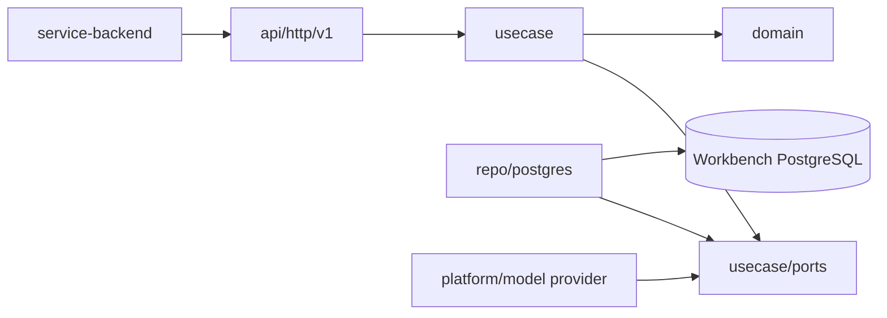

# Endge AI Workbench Architecture

## 1. Назначение

AI Workbench — приватное backend-приложение. Публичной точкой входа для
Configurator остаётся `service-backend`.

На текущем этапе Workbench содержит только runtime skeleton. Документ фиксирует
границы, которые нельзя нарушать при добавлении первой бизнесовой функции.

## 2. Владение

`service-backend` владеет:

- пользовательской сессией и workspace authorization;
- AI access и разрешёнными model profiles;
- credential references;
- документами, ревизиями и коммитами;
- окончательной проверкой и применением изменений.

AI Workbench в будущем будет владеть:

- conversations и agent runs;
- model adapters;
- tool orchestration;
- execution checkpoints и traces;
- RAG indexes и извлечением контекста.

Workbench не подключается к базе `service-backend` и не изменяет её напрямую.

## 3. Слои



Пока business flow отсутствует, repository и usecase packages не создаются.
После появления реального consumer применяются правила:

- `domain` не зависит от HTTP, middleware и PostgreSQL;
- `usecase` владеет orchestration и transaction boundary;
- `usecase` зависит от infrastructure только через ports;
- HTTP adapters не обращаются к repository напрямую;
- provider-specific SDK не выходит за infrastructure boundary;
- composition root связывает implementations в `internal/bootstrap`.

## 4. HTTP

Текущий технический API:

```text
GET /health
GET /version
GET /swagger
GET /swagger/openapi3.yaml
```

Новые business endpoints добавляются под `/api/v1`. OpenAPI остаётся
минимальным, пока таких endpoints нет.

## 5. Аутентификация

Development skeleton запускается с `AUTH_ENABLED=false` и не содержит
business endpoints. До появления первого внутреннего API должен быть выбран и
реализован service-to-service contract между `service-backend` и Workbench.

Browser CORS для Workbench не включается: Configurator работает только через
основной backend.

## 6. Persistence

Workbench получает собственную PostgreSQL-базу только вместе с первым
persistent domain flow. Миграции не создаются заранее без реальных таблиц.

Состояние основного backend не копируется в Workbench как второй источник
истины. Допустимы только scoped snapshots, indexes и execution metadata с
явным владельцем и lifecycle.

## 7. Telemetry

- traces и metrics экспортируются через OTLP;
- structured logs пишутся в stdout;
- входящий `traceparent` продолжает trace основного backend;
- недоступность collector не ломает request flow;
- секреты, prompt payloads и содержимое документов не логируются по умолчанию.

## 8. Первая бизнесовая итерация

Первым vertical slice должен стать read-only поток:

```text
Configurator -> service-backend -> Workbench -> model provider
```

Он не создаёт и не применяет изменения домена. Plans, tools и mutation flow
добавляются только следующими отдельными итерациями.
